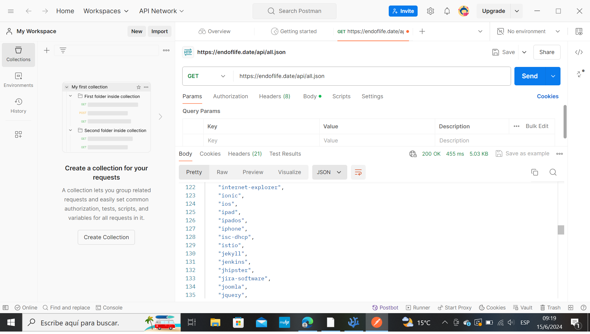

# Building-an-API-Client-Library-with-Rust

## Descripción gral

El mundo está intrincadamente conectado por miles de millones de dispositivos electrónicos, y las personas se comunican con amigos y familiares a través del correo electrónico y las aplicaciones de mensajería. Mientras tanto, otros están absortos en un mar de actividades en línea, desde la navegación web hasta la colaboración en los servidores de Discord y la creación de soluciones innovadoras utilizando lenguajes de programación como Rust.

## Objetivos gral

> Conozca cómo funcionan las API

> Utilice cURL de forma eficaz para explorar las API

> Uso eficaz de Postman para explorar las API

> Analice la comunicación entre la solicitud y la obtención de una respuesta de una API

> Crea tu propia biblioteca de API en Rust con la ayuda de serde-rs

> Pruebe su biblioteca de API para que sea confiable

## Aprende cómo se comunican las computadoras - Tarea N° 1

        *Comprender el concepto detrás de las API

        *Más información sobre con qué se comunican los equipos

        *Usar cURL y Postman para explorar las API mediante HTTP y HTTPS

    
### Detalles de la tarea

En el mundo interconectado de hoy, es crucial comprender cómo se comunican las computadoras. Un elemento clave de esta comunicación es el uso de APIs, o Interfaces de Programación de Aplicaciones. Las API sirven como puente entre diferentes aplicaciones de software, lo que les permite interactuar y compartir datos. En esta sección, profundizaremos en el fascinante mundo de las API, explorando cómo funcionan y por qué son tan integrales para nuestra vida digital.

        Paso 1:    La interfaz de programación de aplicaciones

        ¡Las API están en todas partes! Su teléfono inteligente, su computadora portátil e incluso sus dispositivos domésticos tienen algún tipo de API para comunicarse entre dispositivos en la red o entre interfaces de hardware y software. Puede pensar en las API como una traducción entre dos idiomas y también como una especificación de lo que puede hacer.

        Otro buen ejemplo es la tecnología más utilizada hoy en día: Internet. Por ejemplo, si estamos accediendo al sitio web de StackUp, le estamos pidiendo que nos dé acceso como una solicitud HTTP que contiene datos que le dicen al servidor qué hacer.

        De esta forma, si nuestras credenciales son correctas, el servidor del sitio web envía una respuesta de que ahora podemos acceder al sitio web. Esto se hace a través de una API. La API puede ser cualquier forma de datos. Tal vez contenido HTML simple o incluso JSON.

                    Las bibliotecas también son API

        Cuando se consideran cuidadosamente, las bibliotecas pueden verse como API, aunque más abstractas y específicas de dominio que las interfaces de programación de aplicaciones tradicionales.

        Si importas una caja de biblioteca desde Rust, básicamente estás trayendo los espacios de nombres disponibles a tu código desde la propia biblioteca. Esto significa que también está hablando con las definiciones de funciones, las constantes, los rasgos, los tipos de datos personalizados y las interfaces personalizadas escritas por quien haya creado esa biblioteca.

        De esta manera, la comunicación entre su código y sus bibliotecas está ocurriendo, que es básicamente lo que son las API. 

        Paso 2:        Consejos para aprender cómo funciona una API

        *Lectura de la documentación*
        No subestimes la importancia de leer y ser un buen lector. Para convertirte en un buen desarrollador e ingeniero, debes buscar documentación. Los tutoriales son buenos, pero no dan toda la esencia de la tecnología. Tienes que sumergirte en la documentación en sí.

        Si falta algo a lo largo de la documentación o falta la documentación en sí, debe abrir un ticket para el proyecto ascendente en el que se necesita documentación. Sin embargo, existen casos en los que la documentación es escasa, especialmente proyectos antiguos. Si ese es el caso, debe estar listo para leer el código fuente en sí, pero llevaría mucho tiempo y sería más difícil.

        Paso 3:        API de fecha de fin de vida útil

        En esta campaña, echaremos un vistazo a https://endoflife.date, un sitio que agrega información sobre las fechas del ciclo de lanzamiento y el final de la vida útil de los productos y el software. Esto incluye productos como marcas de teléfonos inteligentes y software como Rust.

        Paso 4:    Herramientas esenciales para explorar las API web: cURL

**¿Qué es cURL?**

                cURL es una utilidad de línea de comandos que permite transferir datos desde o hacia un servidor utilizando URLs. Es compatible con protocolos conocidos como HTTP, HTTPS y FTP. Funciona con la biblioteca de C, libcurl, para todas las funciones relacionadas con la transferencia.

**Cómo instalar cURL**
                Windows

                cURL está disponible en Windows. Puede instalarlo a través de un administrador de paquetes como scoop o winget de Microsoft. Siga las instrucciones sobre cómo instalar estos administradores de paquetes antes de instalar cURL o simplemente instálelo manualmente desde el sitio oficial, https://curl.se/windows/.

**Mac y Linux**

                Por lo general, cURL se instala de forma predeterminada tanto en Mac/OSX como en Linux. Sin embargo, si no está instalado, puede usar un gestor de paquetes como brew o el gestor de paquetes oficial de su distribución de Linux, como apt para distribuciones basadas en Debian y rpm para distribuciones basadas en RPM. Siga la guía de sus sistemas sobre cómo usar e instalar desde los administradores de paquetes, ya que esto no se tratará en esta guía debido a las diferencias en las distribuciones.

**Ejemplo de uso**

                Para nuestra campaña, si vas a usar cURL para explorar https://endoflife.date, simplemente puedes ejecutar el siguiente conjunto de comandos:

                Para obtener todos los ciclos de lanzamiento de un producto específico. Intente reemplazar "suproducto" con "rust"

                curl https://endoflife.date/api/yourproduct.json

                Para obtener un ciclo de lanzamiento específico de un producto específico. Intente reemplazar "suproducto" por "óxido" y "suciclo" por "1.78". Para evitar confusiones, los ciclos también pueden significar una versión del producto.

                curl https://endoflife.date/api/yourproduct/yourcycle.json

                Para que todos los productos estén disponibles para su uso

                curl https://endoflife.date/api/all.json

                Aunque, ejecutar solo curl es suficiente, el uso futuro de curl podría necesitar que seas más específico. El comando de mano larga para nuestros ejemplos anteriores es

                curl --request GET --url <URL>

                donde la URL (sin los símbolos "<" y ">") son los puntos de conexión de la API. Los puntos de conexión de la API son solo los ejemplos de URL que usamos antes. Por ahora, no necesita saber mucho sobre qué son otros tipos de solicitudes HTTP. Solo tienes que seguirlo por ahora.

                Para embellecer nuestra salida, puede usar jq, una utilidad de línea de comandos que filtra json. Echa un vistazo al comando de la captura de pantalla a continuación para verlo en acción.

        Paso 5:    Herramientas esenciales para explorar las API web: Postman

            Si prefiere usar una interfaz gráfica de usuario para explorar las solicitudes y respuestas de la API en lugar de usar cURL en su terminal, podemos usar Postman.

            Entonces, ¿qué es Postman? Puedes dirigirte a su sitio web en https://www.postman.com/home y ver

            Postman es una plataforma de API para crear y usar API. Postman simplifica cada paso del ciclo de vida de la API y agiliza la colaboración para que pueda crear mejores API más rápido.
        
            Una descripción de lo que es Postman en su página de inicio.
            Es una herramienta realmente poderosa para esta búsqueda porque simplifica la forma en que exploramos las API con solo hacer clic en un botón.

